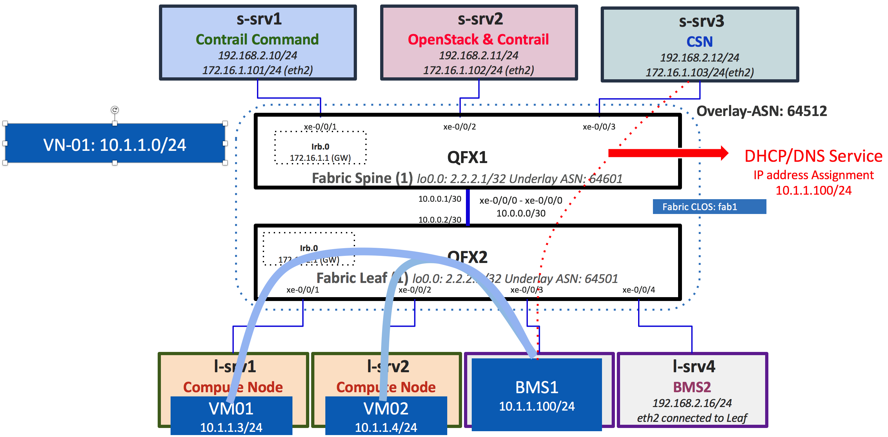
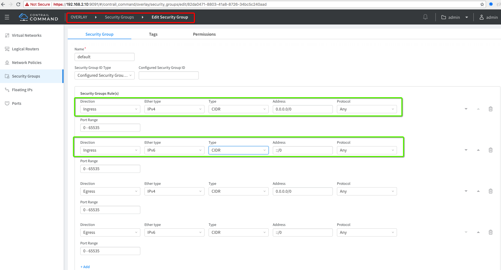
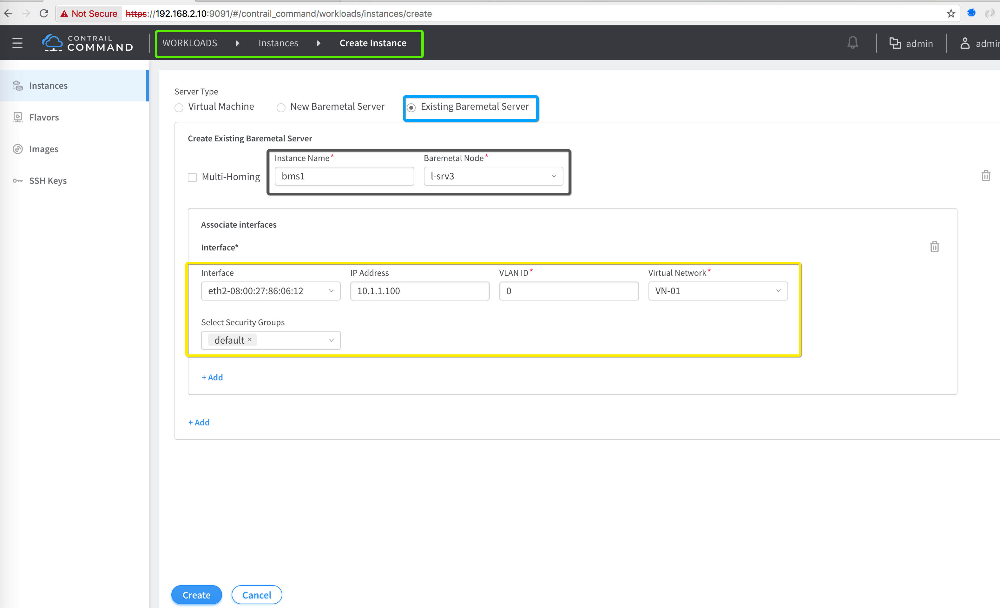
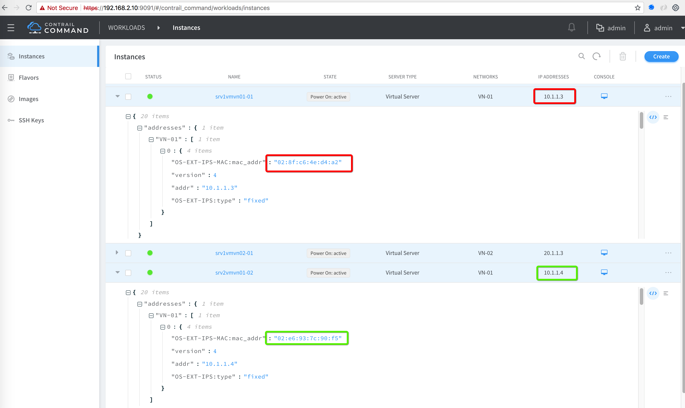
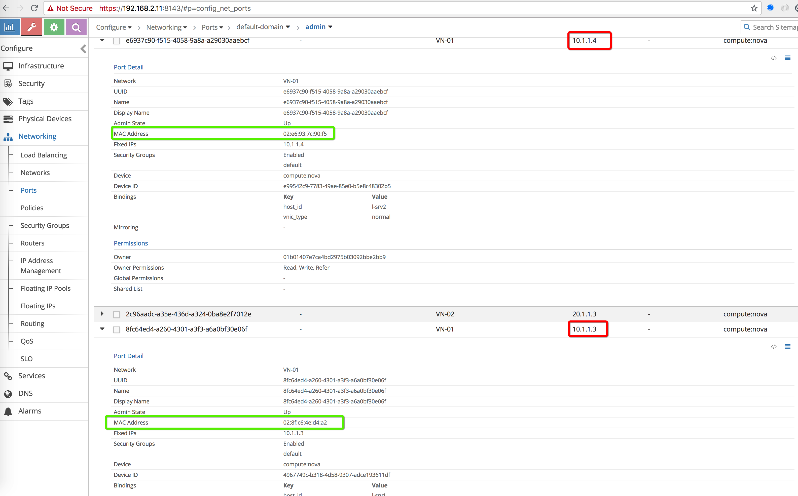

# BMS to VM Intra VN 

At this stage our Contrail Fabric Manager setup is up and ready for some overlay/underlay use-cases testing. Let's test BMS to VM intra Virtual Network Type-2 connectivity, please follow below instructions.



## 1. Created Workload

Let's first create two VMs on each compute l-srv1 & l-srv2 from VN VN-01 CIDR "10.1.1.0/24" & VN-02 CIDR "20.1.1.0/24" using the script.

Note: Connect to ***s-srv2*** and for the workshop the script is already in "/home/vagrant" folder of s-srv2.

```bash
wget https://raw.githubusercontent.com/qarham/cfm-vagrant/master/cfm-1x1-vqfx-7srv/scripts/create-workload.sh
chmod +x create-workload.sh

vagrant ssh s-svr2
ls
./create-workload.sh
 ```

## 2. Add Non-LCM BMS node

In our topology BMS is also a VM and two BMS Non-LCM servers "l-srv4 & l-srv5" are already added during "Server Addition" step of Infrastructure creation.


```bash
# Get MAC address of srv4 eth2 interface

ip link show eth2
4: eth2: <BROADCAST,MULTICAST,UP,LOWER_UP> mtu 1500 qdisc pfifo_fast state UP mode DEFAULT group default qlen 1000
    link/ether 08:00:27:8a:7d:b1 brd ff:ff:ff:ff:ff:ff

```

## 3. Update Default Secuirty Group

Update default security group for ingress rule and allow all traffic.

* Overlay --> Security Group --> Edit SecurittyGroups




## 4. Create BMS instance



```bash
dhclient eth2

# In case you have to kill dhclient and renew the IP use following steps
pkill dhclient
dhclient eth2
 ```

On CSN node "s-srv3" monitor DHCP request from BMS instances and check right IP is assigned to BMS instance. In our case 10.1.1.100 is assigned to BMS instance "bms1"


```bash
tcpdump -nei eth2 port 4789
tcpdump: verbose output suppressed, use -v or -vv for full protocol decode
listening on eth2, link-type EN10MB (Ethernet), capture size 262144 bytes
18:49:35.418985 02:05:86:71:f0:00 > 08:00:27:a6:81:14, ethertype IPv4 (0x0800), length 392: 2.2.2.2.27334 > 172.16.1.103.4789: VXLAN, flags [I] (0x08), vni 4
08:00:27:86:06:12 > Broadcast, ethertype IPv4 (0x0800), length 342: 0.0.0.0.bootpc > 255.255.255.255.bootps: BOOTP/DHCP, Request from 08:00:27:86:06:12, length 300
18:49:35.419389 08:00:27:a6:81:14 > 02:05:86:71:f0:00, ethertype IPv4 (0x0800), length 372: 172.16.1.103.62216 > 2.2.2.2.4789: VXLAN, flags [I] (0x08), vni 4
08:00:27:a6:81:14 > 08:00:27:86:06:12, ethertype IPv4 (0x0800), length 322: 10.1.1.2.bootps > 10.1.1.100.bootpc: BOOTP/DHCP, Reply, length 280
18:49:35.718894 02:05:86:71:f0:00 > 08:00:27:a6:81:14, ethertype IPv4 (0x0800), length 110: 2.2.2.2.9569 > 172.16.1.103.4789: VXLAN, flags [I] (0x08), vni 4
08:00:27:86:06:12 > Broadcast, ethertype ARP (0x0806), length 60: Request who-has 10.1.1.100 (Broadcast) tell 0.0.0.0, length 46
18:49:36.718661 02:05:86:71:f0:00 > 08:00:27:a6:81:14, ethertype IPv4 (0x0800), length 110: 2.2.2.2.9569 > 172.16.1.103.4789: VXLAN, flags [I] (0x08), vni 4
08:00:27:86:06:12 > Broadcast, ethertype ARP (0x0806), length 60: Request who-has 10.1.1.100 (Broadcast) tell 0.0.0.0, length 46
^C
4 packets captured
4 packets received by filter

 ```

Note: In case tcpdump is not installed please install using following command.

```bash
yum install -y tcpdump
 ```

## 5. Configuration Pushed to vQFX

```bash
show groups | display set
set groups __contrail__ interfaces lo0 unit 0 family inet address 1.1.1.1/32 primary
set groups __contrail__ interfaces lo0 unit 0 family inet address 1.1.1.1/32 preferred
set groups __contrail__ interfaces xe-0/0/3 flexible-vlan-tagging
set groups __contrail__ interfaces xe-0/0/3 native-vlan-id 4094
set groups __contrail__ interfaces xe-0/0/3 encapsulation extended-vlan-bridge
set groups __contrail__ interfaces xe-0/0/3 unit 0 vlan-id 4094
set groups __contrail__ routing-options router-id 1.1.1.1
set groups __contrail__ routing-options route-distinguisher-id 1.1.1.1
set groups __contrail__ routing-options autonomous-system 64512
set groups __contrail__ routing-options resolution rib bgp.rtarget.0 resolution-ribs inet.0
set groups __contrail__ protocols bgp group _contrail_asn-64512 type internal
set groups __contrail__ protocols bgp group _contrail_asn-64512 local-address 1.1.1.1
set groups __contrail__ protocols bgp group _contrail_asn-64512 hold-time 90
set groups __contrail__ protocols bgp group _contrail_asn-64512 family evpn signaling
set groups __contrail__ protocols bgp group _contrail_asn-64512 family route-target
set groups __contrail__ protocols bgp group _contrail_asn-64512 neighbor 172.16.1.101 peer-as 64512
set groups __contrail__ protocols evpn vni-options vni 4 vrf-target target:64512:8000002
set groups __contrail__ protocols evpn encapsulation vxlan
set groups __contrail__ protocols evpn multicast-mode ingress-replication
set groups __contrail__ protocols evpn extended-vni-list all
set groups __contrail__ policy-options policy-statement _contrail_VN-01-l2-4-import term _contrail_switch_policy_ from community _contrail_switch_policy_
set groups __contrail__ policy-options policy-statement _contrail_VN-01-l2-4-import term _contrail_switch_policy_ then accept
set groups __contrail__ policy-options policy-statement _contrail_VN-01-l2-4-import term t1 from community _contrail_target_64512_8000002
set groups __contrail__ policy-options policy-statement _contrail_VN-01-l2-4-import term t1 then accept
set groups __contrail__ policy-options policy-statement _contrail_switch_export_policy_ term t1 then community add _contrail_switch_export_community_
set groups __contrail__ policy-options community _contrail_target_64512_8000002 members target:64512:8000002
set groups __contrail__ policy-options community _contrail_switch_export_community_ members target:64512:8000002
set groups __contrail__ policy-options community _contrail_switch_policy_ members target:64512:1
set groups __contrail__ switch-options vtep-source-interface lo0.0
set groups __contrail__ switch-options route-distinguisher 1.1.1.1:1
set groups __contrail__ switch-options vrf-import _contrail_VN-01-l2-4-import
set groups __contrail__ switch-options vrf-export _contrail_switch_export_policy_
set groups __contrail__ switch-options vrf-target target:64512:1
set groups __contrail__ switch-options vrf-target auto
set groups __contrail__ vlans contrail_VN-01-l2-4 interface xe-0/0/3.0
set groups __contrail__ vlans contrail_VN-01-l2-4 vxlan vni 4

```


## 3. BMS instance connection to VM

```bash
[root@srv4 vagrant]# dhclient -v eth2
Internet Systems Consortium DHCP Client 4.2.5
Copyright 2004-2013 Internet Systems Consortium.
All rights reserved.
For info, please visit https://www.isc.org/software/dhcp/

Listening on LPF/eth2/08:00:27:83:33:ad
Sending on   LPF/eth2/08:00:27:83:33:ad
Sending on   Socket/fallback
DHCPDISCOVER on eth2 to 255.255.255.255 port 67 interval 6 (xid=0x6a053491)
DHCPREQUEST on eth2 to 255.255.255.255 port 67 (xid=0x6a053491)
DHCPOFFER from 10.1.1.2
DHCPACK from 10.1.1.2 (xid=0x6a053491)
bound to 10.1.1.4 -- renewal in 2147483646 seconds.
[root@srv4 vagrant]# ip address show eth2
4: eth2: <BROADCAST,MULTICAST,UP,LOWER_UP> mtu 1500 qdisc pfifo_fast state UP group default qlen 1000
    link/ether 08:00:27:83:33:ad brd ff:ff:ff:ff:ff:ff
    inet 10.1.1.4/24 brd 10.1.1.255 scope global noprefixroute eth2
       valid_lft forever preferred_lft forever
    inet6 fe80::a00:27ff:fe83:33ad/64 scope link
       valid_lft forever preferred_lft forever
[root@srv4 vagrant]# ping 10.1.1.3
PING 10.1.1.3 (10.1.1.3) 56(84) bytes of data.
64 bytes from 10.1.1.3: icmp_seq=1 ttl=64 time=502 ms
64 bytes from 10.1.1.3: icmp_seq=2 ttl=64 time=185 ms

3 packets transmitted, 3 received, 0% packet loss, time 2005ms
rtt min/avg/max/mdev = 101.738/263.033/502.330/172.591 ms

# DNS servcie is also provided by Contrail Service Node and you can test Contrail DNS reachability by pinging DNS IP 10.1.1.2
[root@srv4 vagrant]#ping 10.1.1.2
PING 10.1.1.2 (10.1.1.2) 56(84) bytes of data.
64 bytes from 10.1.1.2: icmp_seq=1 ttl=64 time=102 ms
64 bytes from 10.1.1.2: icmp_seq=2 ttl=64 time=101 ms

--- 10.1.1.2 ping statistics ---
2 packets transmitted, 2 received, 0% packet loss, time 1028ms
rtt min/avg/max/mdev = 101.908/102.239/102.571/0.460 ms

 ```


```bash
show bgp summary
Groups: 1 Peers: 1 Down peers: 0
Table          Tot Paths  Act Paths Suppressed    History Damp State    Pending
bgp.rtarget.0
                       5          4          0          0          0          0
bgp.evpn.0
                       1          1          0          0          0          0
Peer                     AS      InPkt     OutPkt    OutQ   Flaps Last Up/Dwn State|#Active/Received/Accepted/Damped...
172.16.1.101          64512        270        287       0       0     2:06:34 Establ
  bgp.rtarget.0: 4/5/5/0
  bgp.evpn.0: 1/1/1/0
  default-switch.evpn.0: 1/1/1/0
  __default_evpn__.evpn.0: 0/0/0/0

{master:0}[edit]


show route table default-switch.evpn.0

default-switch.evpn.0: 3 destinations, 3 routes (3 active, 0 holddown, 0 hidden)
+ = Active Route, - = Last Active, * = Both

2:1.1.1.1:1::4::08:00:27:83:33:ad/304 MAC/IP
                   *[EVPN/170] 00:10:46
                      Indirect
3:1.1.1.1:1::4::1.1.1.1/248 IM
                   *[EVPN/170] 00:12:38
                      Indirect
3:172.16.1.103:2::4::172.16.1.103/248 IM
                   *[BGP/170] 00:12:38, MED 200, localpref 100, from 172.16.1.101
                      AS path: ?, validation-state: unverified
                    > to 172.16.1.103 via irb.0
  ```


***Note: Due to current bug you have to statically add the VMs MAC addresses on the BMS side***

Connect to VM created on VN01 via Console or LinkLocal IP (from compute) and get the MAC address OR get the MAC from the VM VMI port in Contrail GUI. After getting the MAC now add static MAC entry using following command on BMS1

***How to get MAC from New Contrail Command UI***



***How to get MAC from old Contrail UI***



```bash
# Let's add static MAC for the overlay VMI due to a bug 
arp -s 10.1.1.4 02:e6:93:7c:90:f5
arp -s 10.1.1.3 02:8f:c6:4e:d4:a2

# Check MAC entries are added sucessfully
arp -a
? (10.1.1.4) at 02:e6:93:7c:90:f5 [ether] PERM on eth2
paulh-lt1.jnpr.net (10.1.1.3) at 02:8f:c6:4e:d4:a2 [ether] PERM on eth2
convergys-jspn-ce-fw1-ge-2-0-0-0.jnpr.net (10.1.1.1) at <incomplete> on eth2
? (10.0.2.3) at 52:54:00:12:35:03 [ether] on eth0
gateway (10.0.2.2) at 52:54:00:12:35:02 [ether] on eth0

# Startt ping from BMS1 to VM with IP 10.1.1.3
ping 10.1.1.3
PING 10.1.1.3 (10.1.1.3) 56(84) bytes of data.
64 bytes from 10.1.1.3: icmp_seq=1 ttl=64 time=162 ms
^C
--- 10.1.1.3 ping statistics ---
1 packets transmitted, 1 received, 0% packet loss, time 0ms
rtt min/avg/max/mdev = 162.053/162.053/162.053/0.000 ms

# Startt ping from BMS1 to VM with IP 10.1.1.4
ping 10.1.1.4
PING 10.1.1.4 (10.1.1.4) 56(84) bytes of data.
64 bytes from 10.1.1.4: icmp_seq=1 ttl=64 time=389 ms
64 bytes from 10.1.1.4: icmp_seq=2 ttl=64 time=102 ms
^C
--- 10.1.1.4 ping statistics ---
2 packets transmitted, 2 received, 0% packet loss, time 1008ms
rtt min/avg/max/mdev = 102.450/246.060/389.670/143.610 ms

 ```


## Tips

Other useful commands:

```bash
show bgp summary

show route advertising-protocol bgp 172.16.1.101

show route receive-protocol bgp 172.16.1.101

show ethernet-switching table

show evpn database

show interfaces vtep

 ```


### References

* <https://github.com/Juniper/contrail-ansible-deployer/wiki>
