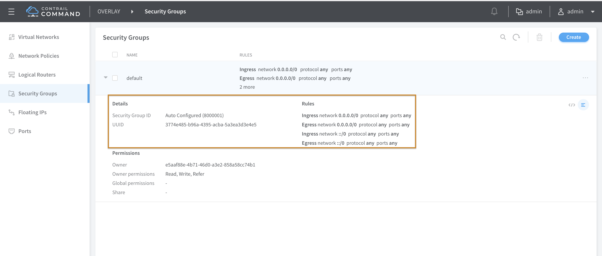
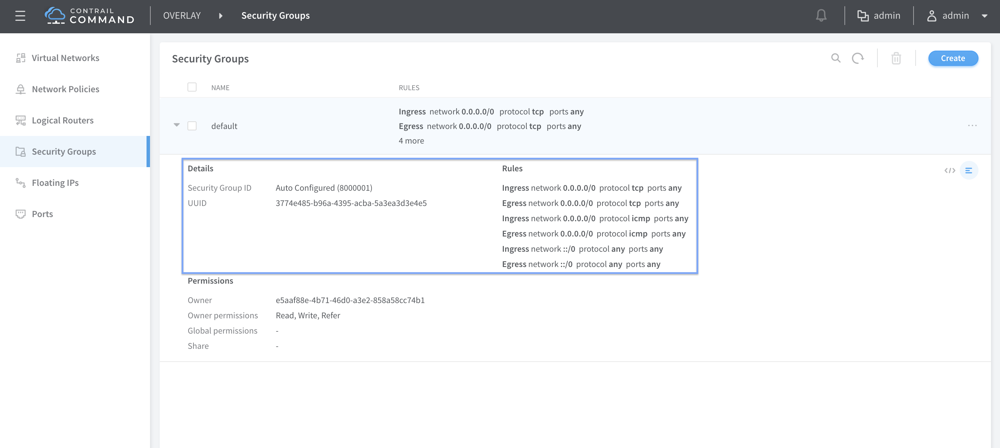

# Security policies for bare-metal servers using Contrail security groups.

Contrail from day one supported security groups rules applied on the virtual-machine interface of a vrouter. These security group rules were injected as the flow rules on the vrouter forwarding module. Security group support for containers and host kernel (vhost0) was added in the later releases of Contrail. Starting 5.0 release of Contrail with the Contrail Fabric product security groups can now be applied to a interface of a bare-metal server which is connected to a QFX TOR switch. The Contrail device manager will convert these security group rules to equivalent JUNOS firewall filter rules and these rules are then applied on the Junos etherent interface (ge, xe or et) that connects to the bare-metal server.


## 1. Edit the security groups and add specific rules to permit only TCP and ICMP flows.
On the Contrail command mega menu navigate to Overlay - Security Groups to open the security group page. The default security group that was created during the provisioning of the cluster should have rules to permit all IPV4 and IPV6 traffic in both ingress and egress direction. Edit the security group and change the ingress and egress rules for IPV4 protocol to permit only TCP traffic. Scroll to the bottom of the Security Group edit screen and click on the '+' sign to add a second set of rules to permit IPV4 ICMP flows in ingress and egress direction. There is no requirement to modify IPV6 SG rules for this use case.





## 2. Verify the translation of SG rules to Junos firewall filter rules.
As soon as security group changes are saved at the end of step 1. Contrail device manager will translate the security group rules to equivalent Junos firewall filter rules and will commit the Configuration on qfx2 which is the TOR switch connected to l-srv3 and l-srv4 where the security groups are attached. Observe the flows other than the traffic type permitted by the security group rules (TCP and ICMP) in the list of firewall filter rules !

```bash
set groups __contrail__ firewall family ethernet-switching filter sg-filter-IPv4-default-02cf0608-19ff-4f41-a7d4-0087bcd80ace term ether-type from ether-type arp
set groups __contrail__ firewall family ethernet-switching filter sg-filter-IPv4-default-02cf0608-19ff-4f41-a7d4-0087bcd80ace term ether-type then accept
set groups __contrail__ firewall family ethernet-switching filter sg-filter-IPv4-default-02cf0608-19ff-4f41-a7d4-0087bcd80ace term allow-dns-dhcp from source-port 67
set groups __contrail__ firewall family ethernet-switching filter sg-filter-IPv4-default-02cf0608-19ff-4f41-a7d4-0087bcd80ace term allow-dns-dhcp from source-port 68
set groups __contrail__ firewall family ethernet-switching filter sg-filter-IPv4-default-02cf0608-19ff-4f41-a7d4-0087bcd80ace term allow-dns-dhcp from source-port 53
set groups __contrail__ firewall family ethernet-switching filter sg-filter-IPv4-default-02cf0608-19ff-4f41-a7d4-0087bcd80ace term allow-dns-dhcp from ip-protocol udp
set groups __contrail__ firewall family ethernet-switching filter sg-filter-IPv4-default-02cf0608-19ff-4f41-a7d4-0087bcd80ace term allow-dns-dhcp then accept
set groups __contrail__ firewall family ethernet-switching filter sg-filter-IPv4-default-02cf0608-19ff-4f41-a7d4-0087bcd80ace term default-term from destination-port 0-65535
set groups __contrail__ firewall family ethernet-switching filter sg-filter-IPv4-default-02cf0608-19ff-4f41-a7d4-0087bcd80ace term default-term from ip-destination-address 0.0.0.0/0
set groups __contrail__ firewall family ethernet-switching filter sg-filter-IPv4-default-02cf0608-19ff-4f41-a7d4-0087bcd80ace term default-term from ip-protocol 6
set groups __contrail__ firewall family ethernet-switching filter sg-filter-IPv4-default-02cf0608-19ff-4f41-a7d4-0087bcd80ace term default-term then accept
set groups __contrail__ firewall family ethernet-switching filter sg-filter-IPv4-default-a176d8fa-e806-4c49-aaf8-eea19ef0c105 term ether-type from ether-type arp
set groups __contrail__ firewall family ethernet-switching filter sg-filter-IPv4-default-a176d8fa-e806-4c49-aaf8-eea19ef0c105 term ether-type then accept
set groups __contrail__ firewall family ethernet-switching filter sg-filter-IPv4-default-a176d8fa-e806-4c49-aaf8-eea19ef0c105 term allow-dns-dhcp from source-port 67
set groups __contrail__ firewall family ethernet-switching filter sg-filter-IPv4-default-a176d8fa-e806-4c49-aaf8-eea19ef0c105 term allow-dns-dhcp from source-port 68
set groups __contrail__ firewall family ethernet-switching filter sg-filter-IPv4-default-a176d8fa-e806-4c49-aaf8-eea19ef0c105 term allow-dns-dhcp from source-port 53
set groups __contrail__ firewall family ethernet-switching filter sg-filter-IPv4-default-a176d8fa-e806-4c49-aaf8-eea19ef0c105 term allow-dns-dhcp from ip-protocol udp
set groups __contrail__ firewall family ethernet-switching filter sg-filter-IPv4-default-a176d8fa-e806-4c49-aaf8-eea19ef0c105 term allow-dns-dhcp then accept
set groups __contrail__ firewall family ethernet-switching filter sg-filter-IPv4-default-a176d8fa-e806-4c49-aaf8-eea19ef0c105 term default-term from destination-port 0-65535
set groups __contrail__ firewall family ethernet-switching filter sg-filter-IPv4-default-a176d8fa-e806-4c49-aaf8-eea19ef0c105 term default-term from ip-destination-address 0.0.0.0/0
set groups __contrail__ firewall family ethernet-switching filter sg-filter-IPv4-default-a176d8fa-e806-4c49-aaf8-eea19ef0c105 term default-term from ip-protocol 1
set groups __contrail__ firewall family ethernet-switching filter sg-filter-IPv4-default-a176d8fa-e806-4c49-aaf8-eea19ef0c105 term default-term then accept
```


